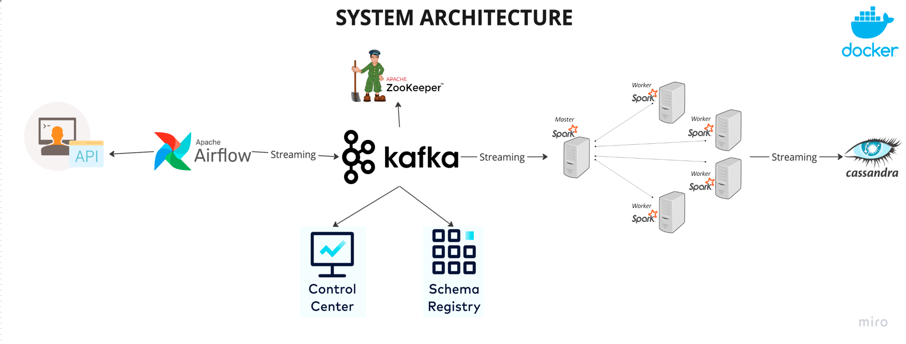
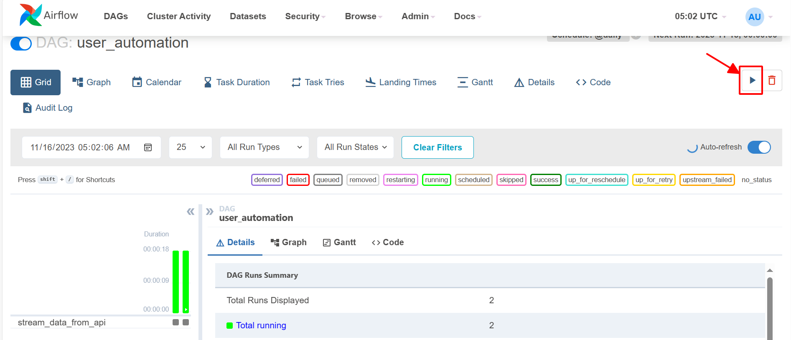
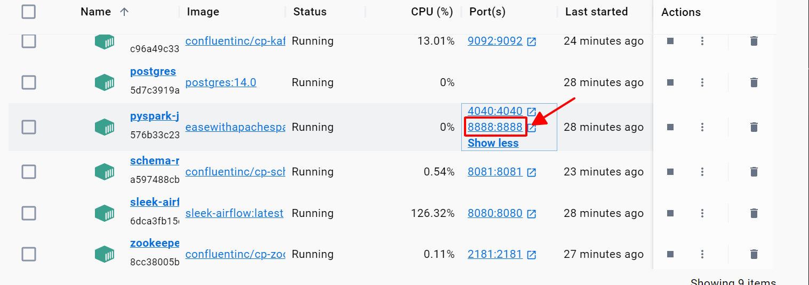
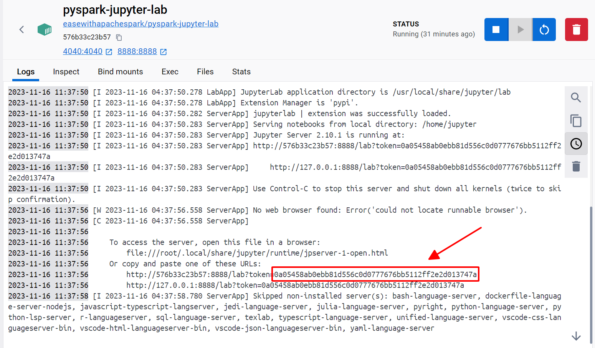
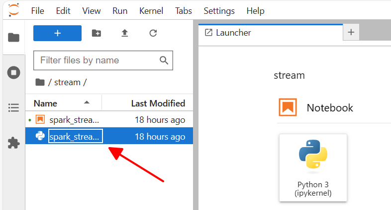
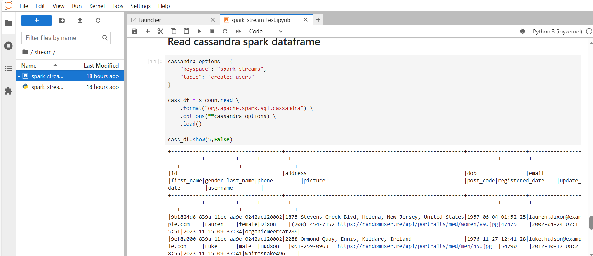

# Comprehensive Guide to Real-time Data Streaming | End-to-End Data Engineering

## Table of Contents
- [Introduction](#introduction)
- [Architecture Overview](#architecture-verview)
- [Key Learning Objectives](#key-learning-objectives)
- [Technologies](#technologies)
- [Getting Started](#getting-started)

## Introduction

Welcome to our comprehensive guide on building a complete end-to-end data engineering pipeline for real-time data streaming. This project covers every stage from data ingestion to processing and storage, utilizing a powerful tech stack that includes Apache Airflow, Python, Apache Kafka, Apache Zookeeper, Apache Spark, and Cassandra. All components are containerized using Docker, ensuring easy deployment and scalability.

## Architecture Overview



The project is structured with the following components:

- **Data Source**: Utilizes the `randomuser.me` API to generate random user data for the pipeline.
- **Apache Airflow**: Orchestrates the pipeline
- **Apache Kafka and Zookeeper**: Facilitates streaming data to the processing engine.
- **Control Center and Schema Registry**: Aids in monitoring and schema management of Kafka streams.
- **Apache Spark**: Handles data processing with both master and worker nodes.
- **Cassandra**: Serves as the storage solution for processed data.

## Key Learning Objectives

- Set up a data pipeline using Apache Airflow
- Implement real-time data streaming with Apache Kafka
- Understand distributed synchronization using Apache Zookeeper
- Apply data processing techniques with Apache Spark (Jupyterlab)
- Explore data storage solutions with Cassandra
- Containerize your entire data engineering setup with Docker

## Technologies

- Apache Airflow
- Python
- Apache Kafka
- Apache Zookeeper
- Apache Spark (Jupyterlab)
- Cassandra
- Docker

## Getting Started

1. Clone the repository:
    ```bash
    git clone https://github.com/hauct/de_realtime_streaming_project.git
    ```

2. Navigate to the project directory:
    ```bash
    cd de_realtime_streaming_project
    ```

3. Run Docker Compose to start the services:
    ```bash
    docker-compose up
    ```

## Detailed Walkthrough:

1. In your Docker Desktop, open port `8080` to open Airflow-CLI

**Important note**: If you're using Windows, you need to change from "CRLF" to "LF" on the file "entry.sh", to run it on dockerized environment


2. Navigate to the file `./airflow/standalone_admin_password.txt`, parse the password on Airflow-CLI to login. And run the dag `user_automation`




3. In your Docker Desktop, open port `8888` to access to Jupyterlab. After that, click on the jupyterlab container to get the token





4. In Jupyterlab-CLI, open the terminal, change to directory `stream` and run the file `spark_stream.py`

```bash
cd stream
python spark_stream.py
```



You can also recheck the result on the file `spark_stream_test.ipynb`

